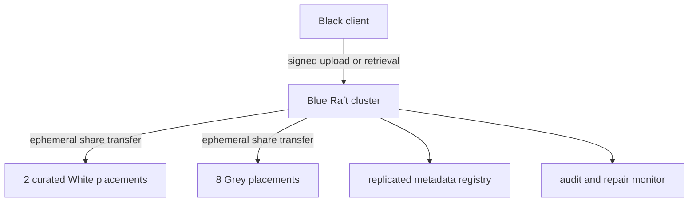
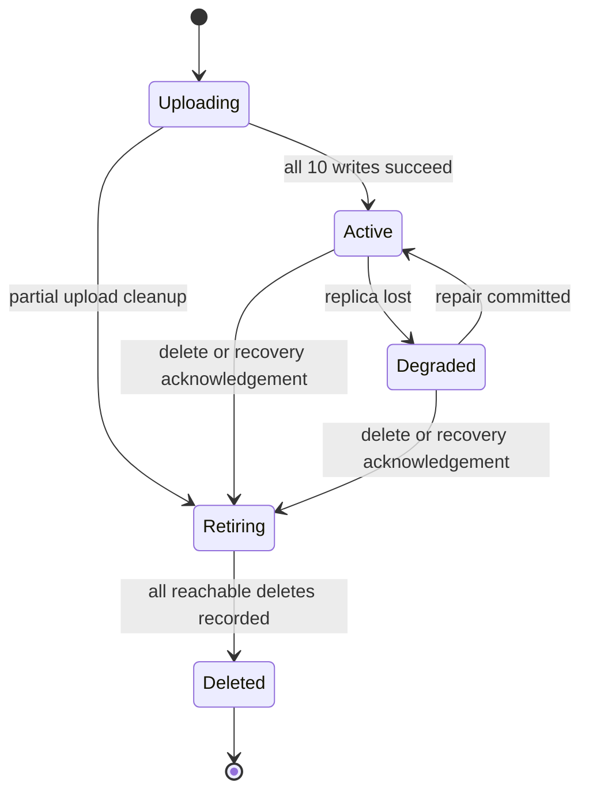

# Qchain architecture

## Design goals

Qchain stores small credentials with minimal network and operator complexity. It deliberately excludes media storage, peer-to-peer gossip, blockchain consensus, and economic incentives. The current maximum plaintext credential size is 64 KiB.

The design separates three concerns:

1. Qshard performs local cryptography and never needs the network.
2. Storage nodes persist opaque encrypted shares.
3. Blue nodes coordinate placement and lifecycle through a replicated registry while treating share payloads as ephemeral traffic.

## Placement invariant

Qshard creates five encrypted shares with threshold three. The registry assigns exactly ten replicas to ten distinct node identities.

| Share index | White replicas | Grey replicas | Total |
|---:|---:|---:|---:|
| 1 | 1 | 1 | 2 |
| 2 | 1 | 1 | 2 |
| 3 | 0 | 2 | 2 |
| 4 | 0 | 2 | 2 |
| 5 | 0 | 2 | 2 |

Eligible nodes must be healthy and have capacity. Rendezvous-style hashing produces deterministic ranking per credential set. Distinct failure domains are preferred before a second node from an already-used domain is considered.

Two White nodes are necessary for placement. At least one additional White and one additional Grey node should be available if operators expect automatic repair after either role is lost.

## Cryptographic construction

Each recovery capsule contains a random 256-bit recovery seed. For a credential set identifier, HKDF-SHA-256 derives two independent 256-bit values:

- `qchain/v1/shard-encryption` for XChaCha20-Poly1305
- `qchain/v1/control-signing` for an Ed25519 signing key

Shamir sharing runs over the original credential bytes with threshold three and five shares. Each raw share is independently encrypted using a random 192-bit nonce. The serialized share header is authenticated as AEAD additional data. A signed manifest binds the set identifier, network, threshold, control public key, share identifiers, indices, hashes, and lengths.

Recovery capsules are encrypted with XChaCha20-Poly1305 using a key produced by Argon2 from the user's passphrase and a random salt. Per-credential mode creates a separate seed and capsule for each set. Master mode reuses one root seed, while per-set HKDF salt still produces independent encryption and control keys.

## Registry consistency

Blue nodes use OpenRaft with a sled-backed log and state machine. The entire logical registry is serialized as one deterministic state value per mutation. Mutating API handlers serialize access, perform a linearizable read, apply one registry state transition, and commit it through Raft.

The registry contains:

- storage-node identities, roles, capacities, status, and committed usage;
- credential manifests, generations, status, and replica locations;
- repair leases;
- request identifiers used for replay rejection;
- deletion tombstones preventing set-identifier reuse.

Raw heartbeat timing remains local to each Blue process. Consensus mutations record suspect, lost, degraded, repaired, retiring, and deleted states.

## Credential lifecycle

### Store

The client first persists its protected recovery capsule and an inactive local record. Blue commits an uploading placement, writes all ten replicas, then commits the set as active. A failed write triggers cleanup and no successful placement receipt is returned.

### Recover and acknowledge

Blue fetches authenticated replicas and returns the first three distinct valid share indices. The client reconstructs locally and successfully writes or emits the plaintext before acknowledging recovery. Only then does Blue commit retirement and delete replicas. Incomplete remote deletions remain in `retiring` and are retried by the monitor.

### Auto-reseed

The client creates and commits a fresh credential set, saves its local record and capsule, and only then acknowledges the original. The acknowledgement identifies the already-active replacement set. The original follows the normal retirement lifecycle.

### Repair

When a node becomes lost, each affected replica is marked lost. The registry creates a time-limited lease with an online same-share source and a distinct eligible destination of the same role. Blue copies the encrypted share, then commits the replacement. Share data is never written to Blue storage.

## Failure semantics

- A Black client retries signed-directory Blue endpoints on transport errors and 5xx responses.
- A storage node retries registration across configured Blue endpoints and follows the first accepting leader.
- Requests to a non-serving Blue member return an unavailable response rather than performing a stale mutation.
- The client keeps inactive local state if upload fails, allowing diagnosis without falsely claiming availability.
- A recovery acknowledgement is never sent before plaintext output and optional replacement placement succeed.
